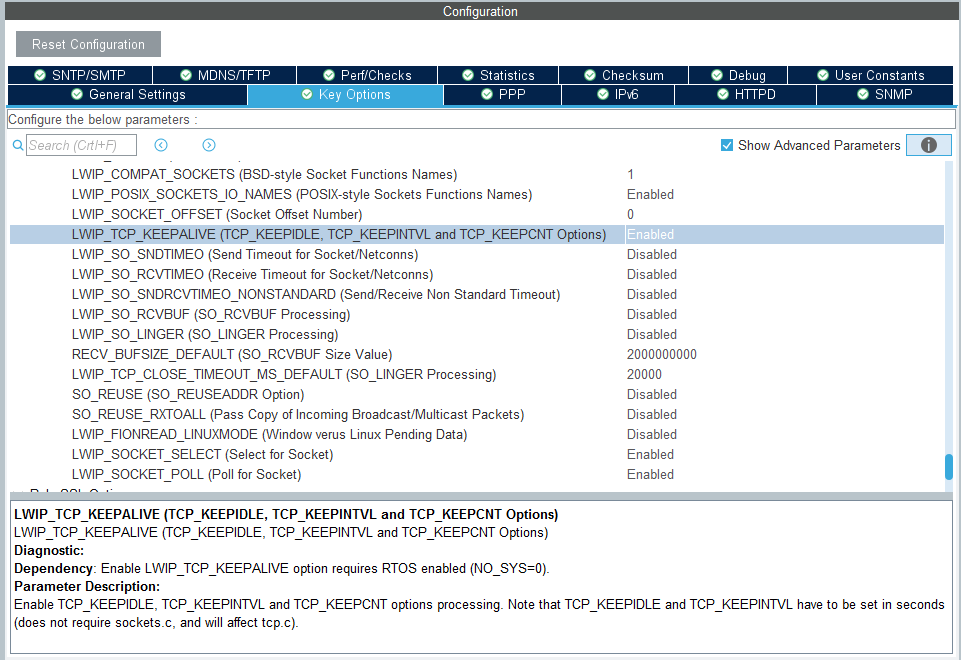

## TCP Connection Time-out

The server implemented in the libscpi starting example permits a single connection. If the remote host network cable is unplugged or something causes the remote host connection to time-out, the scpi server will be inaccessible for a very long (default) waiting time, effectively needing a reset. 

To close stale connections within a few seconds, the server is configured to wait a bit, then test whether the client (remote host) responds. After a number of failed attempts, the connection can be considered lost and will be closed.

In LwIP, this is achieved using [zero window probe](https://www.freesoft.org/CIE//RFC/1122/103.htm) (RFC-793 Section 3.7, page 42). A description on [wireshark.org](https://osqa-ask.wireshark.org/questions/10531/tcp-zerowindow-probe/) is perhaps more approachable in a different context:

	"TCP window probe means that the receiver has reduced his receive buffer 
	(a.k.a. window) to zero, basically telling the sender to stop sending - 
	usually for performance reasons. If the receiver does not recover and 
	send an so called "Window Update" with a buffer size greater than zero 
	(meaning, the sender is allowed to continue) the sender will become 
	"impatient" at some point and "check" if the receiver is able to 
	receive more data. That "check" is the Zero Window Probe you observed."

	If you run into packets diagnosed as Zero Window Probe you can tell 
	that your receiving node is not able to process incoming data fast 
	enough. That is the typical performance problem that everybody blames 
	the network for, while it is in fact a software/hardware problem on 
	the receiving node.

[LwIP supports](https://savannah.nongnu.org/bugs/?25629) a keep-alive mechanism with zero-window probes (see tcp\_out.c tcp\_zero\_window\_probe()). 

### Necessary Modifications

* LWIP\_TCP\_KEEPALIVE needs to be activated in CubeMX.
* tcp_priv.h tcp_tmr() needs to be called every 250 ms (TCP\_TMR\_INTERVAL), done here via a FreeRTOS timer in main.c Timer\_Init( 1, 250, tcp\_tmr\_callback )
* Three values define the keep-alive behavior: in tcp\_priv.h, TCP\_KEEPIDLE\_DEFAULT, TCP\_KEEPINTVL\_DEFAULT and TCP\_KEEPCNT_DEFAULT can be superseded by definition in an lwipopts.h user code section.
* As a new protocol control block (pcb) gets allocated (tcp\_alloc()) when a connection is accepted, the pcb is initialized with defaults. To localize the keep-alive behavior to scpi server connections, the defaults need to be replaced in every newly created pcb.
	- Introduce particular keep-alive values in scpi\_server.h. 
	- Update new pcb in scpi\_server.c processIoListen() and processSrqIoListen(). Note the pcb created in createServer() is being re-purposed when calling netconn\_listen(conn), being partially zero-filled, and an address pointer is put in place of keep\_idle. It does not serve as a template for incoming connections.
	- Details: [http://www.ultimaserial.com/avr_lwip_keepalive.html](http://www.ultimaserial.com/avr_lwip_keepalive.html) describes key protocol control block settings (see api.h union {} pcb)

#### Enabling Keep-Alive

Enable LWIP\_TCP\_KEEPALIVE in STM32CubeMX LwIP Key Options + Advanced Parameters. Note that the description says  TCP\_KEEPIDLE\_DEFAULT, TCP\_KEEPINTVL\_DEFAULT and TCP\_KEEPCNT_DEFAULT are given in seconds, **which they are not. Times are in milliseconds.** This seems to be a mix-up with the sockets API - but here we're using netconn.

New defaults need to be placed in lwipopts.h, which is included earlier than tcp_priv.h and takes precedence:

	/* USER CODE BEGIN 0 */
	// ...
	
	/* LWIP_TCP_KEEPALIVE parameters ( cannot be configured in CubeMX, are not preserved when changed
	 * in tcp_priv.h, so they have to be specified here. ) 
	 */ 
	#define  TCP_KEEPIDLE_DEFAULT   15000UL /* Default KEEPALIVE timer in milliseconds */
	#define  TCP_KEEPINTVL_DEFAULT   5000UL /* Default Time between KEEPALIVE probes in milliseconds */
	#define  TCP_KEEPCNT_DEFAULT        3U  /* Default Counter for KEEPALIVE probes */
	
	/* USER CODE END 0 */		

The fall-back default values given in tcp\_priv.h are overwritten when the project is regenerated and not managed in STM32CubeMX:

	/* Keepalive values, compliant with RFC 1122. Don't change this unless you know what you're doing */
	#ifndef  TCP_KEEPIDLE_DEFAULT
	#define  TCP_KEEPIDLE_DEFAULT     7200000UL /* Default KEEPALIVE timer in milliseconds */
	#endif
	
	#ifndef  TCP_KEEPINTVL_DEFAULT
	#define  TCP_KEEPINTVL_DEFAULT    75000UL   /* Default Time between KEEPALIVE probes in milliseconds */
	#endif
	
	#ifndef  TCP_KEEPCNT_DEFAULT
	#define  TCP_KEEPCNT_DEFAULT      9U        /* Default Counter for KEEPALIVE probes */
	#endif
	
	#define  TCP_MAXIDLE              TCP_KEEPCNT_DEFAULT * TCP_KEEPINTVL_DEFAULT  /* Maximum KEEPALIVE probe time */

Additionally in main.c, tcp\_priv.h needs to be included,

	/* USER CODE BEGIN Includes */
	// ...
	#include "tcp_priv.h"
	
	/* USER CODE END Includes */

And a timer needs to be set up to call tcp\_tmr() periodically:

	void tcp_tmr_callback( TimerHandle_t xTimer){
	    configASSERT( xTimer);
	    tcp_tmr();
	}

Setting up a timer is done via [xTimerCreate()](https://www.freertos.org/FreeRTOS-timers-xTimerCreate.html) and [xTimerStart()](https://www.freertos.org/FreeRTOS-timers-xTimerStart.html).

### Keep-Alive Customization

In scpi\_server.h, add SCPI\_KEEP\_IDLE, SCPI\_KEEP\_INTVL and SCPI\_KEEP\_CNT:
 
	#define SCPI_DEVICE_PORT  5025 // scpi-raw standard port
	#define SCPI_CONTROL_PORT 5026 // libscpi control port (not part of the standard)
	#define SCPI_KEEP_IDLE    2000 // (ms) keepalive quiet time after last TCP packet
	#define SCPI_KEEP_INTVL   1000 // (ms) keepalive repeat interval
	#define SCPI_KEEP_CNT        4 // Retry count before terminating connection (SCPI_KEEP_INTVL * SCPI_KEEP_INTVL (ms)).
 
these values are applied to the newly created pcb structure from netconn_accept():

  
	 static int processIoListen(user_data_t * user_data) {
	    struct netconn *newconn;
	
	    if (netconn_accept(user_data->io_listen, &newconn) == ERR_OK) {
	        if (user_data->io) {
	            /* Close unwanted connection */
	            netconn_close(newconn);
	            netconn_delete(newconn);
	        } else {
	            /* connection established */
	            SCPI_DeviceConnectedEvent(newconn);
	            iprintf("***Connection established %s\r\n", inet_ntoa(newconn->pcb.ip->remote_ip));
	
	            newconn->pcb.tcp->so_options |= SOF_KEEPALIVE;
	            newconn->pcb.tcp->keep_idle   = SCPI_KEEP_IDLE;  // Override TCP_KEEPIDLE_DEFAULT  for this connection.
	            newconn->pcb.tcp->keep_intvl  = SCPI_KEEP_INTVL; // Override TCP_KEEPINTVL_DEFAULT for this connection.
	            newconn->pcb.tcp->keep_cnt    = SCPI_KEEP_CNT;   // Override TCP_KEEPCNT_DEFAULT   for this connection.
	
	            user_data->io = newconn;
	        }
	    }
	
	    return 0;
	}

where the SOF\_KEEPALIVE flag is defined in ip.h (same as SO\_KEEPALIVE).(Setting might be redundant though, but let's be explicit).
