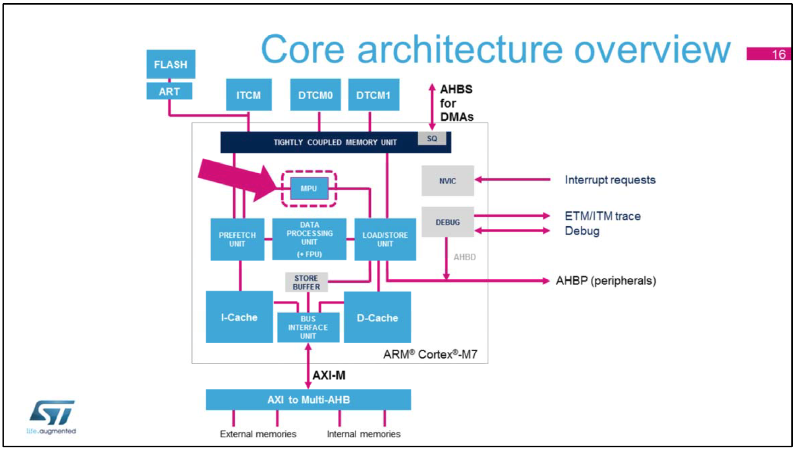
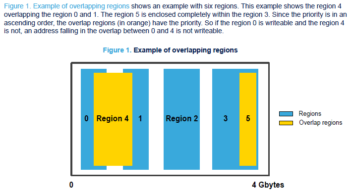
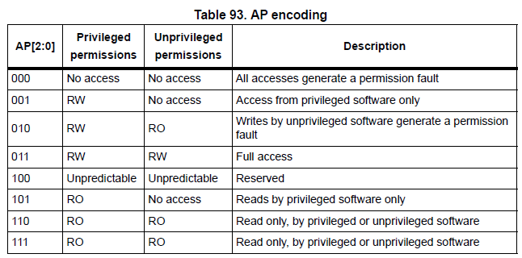
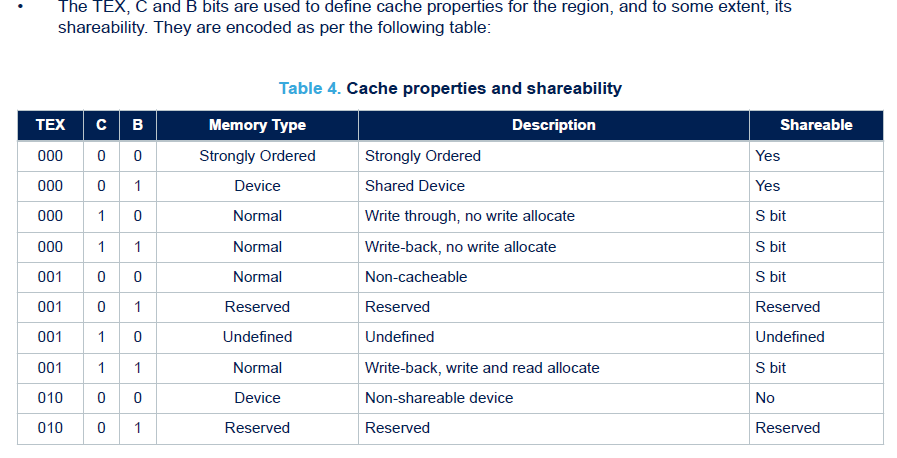
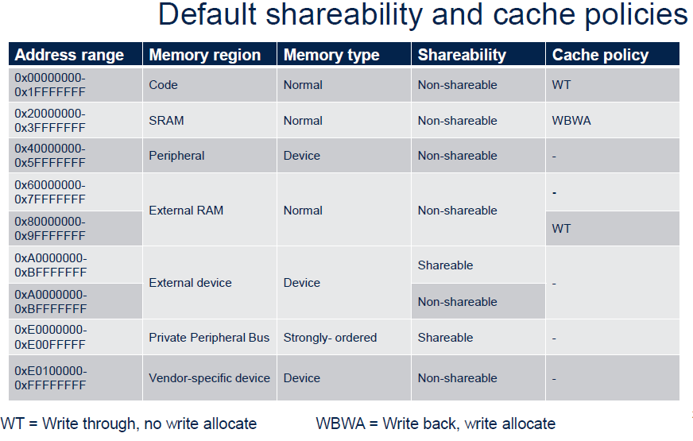

#### Introduction to the Cortex-M7 MPU

Cortex-M microcontrollers come with a Memory Protection Unit (MPU) - or rather a "memory access management unit". MPU use in projects is "optional", and the MPU can be configured to protect memory types from incorrectly structured access. More importantly though, the MPU can be used to 
* prevent code execution from failing due to data incoherency, to
* avoid lock-up due to unpredictable, speculative reads (which is recommended for every project by implementing a safe background region), as well as to
* eliminate write-through access broken in some older Cortex-M7 revisions in favour of write-back access.

Some examples for incorrectly structured access are: attempts to buffer register access (similar to missing volatile declaration), external QSPI flash being written to in a seemingly more efficient out-of-order fashion as opposed to expected program order, or an external memory expecting a single transaction which could be fragmented, partially omitted or interleaved with another transaction to the same memory.

As per PM0214, the MPU attributes don't affect DMA data accesses to the memory/peripherals address spaces, which should apply to both Cortex-M4 and Cortex-M7 architectures.

[STM32F7 System Core presentation](pdf/STM32F7_System_Core_Presentation.pdf) summarizes MPU location and use as:

	In the Cortex-M7 core, the Memory Protection Unit (MPU) 
	is used to configure the bavior of the cache-
	controllers and the AXI-M interface [to internal flash and the AHB bus matrix],
	enforces access rules and separate processes.

The following diagram only goes so far, but serves as an introductory visual idea:

An MPU supports a number (8 or 16) of attribute/parameter sets called Regions.

Memory ranges are configured by creating MPU regions with coinciding Base Address and Size. MPU regions can overlap. The MPU region with the highest number takes precedence. Each region can be considered 8 equally-sized, contiguous and functionally identical copies across 1/8 of the specified Size, and deactivated individually using SubRegion Disable. From AN4838:

 
[AN4838 - Managing memory protection unit in STM32 MCU](pdf/AN4838%20-%20Managing%20memory%20protection%20unit%20in%20STM32%20MCUs.pdf) :
[Table 6](img/AN4838_Table6_Cortex-M_MPU_differences.png) lists MPU features. Cortex-M3, Cortex-M4 and Cortex-M7 feature sets are basically identical, and it's here where the reader is first confronted with a set of capabilities and memory region attributes:

----
#### MPU attributes and parameters

* **Execute Never (XN) : MPU\_INSTRUCTION\_ACCESS\_DISABLE** prevents code execution and disables Instruction Cache. A MemManage [fault exception handler](img/AN209_-_Using_Cortex-M3_M4_M7_Fault_Exceptions.PNG) is triggered upon violation if enabled. By
default, the MemManage fault is disabled so that the HardFault handler is executed. 

* **Access Permissions (AP)**: Cortex-M7 processors have a Handler mode (reset state, privileged access applies) and a Thread mode (unprivileged / user access applies). For both modes, Read/Write, Read-Only and No Access permissions can be selected:

	
	
	Again, a MemManage fault exception should be raised upon violation.

* **Shareability (S)**: Shareable is perhaps the most abstract MPU region attribute. For STM32F7 and STM32H7 microcontrollers, Shareable just deactivates D-Cache. A detailed explanation is given below.

	An [ARM forum reply](https://community.arm.com/developer/ip-products/processors/f/cortex-a-forum/5468/shareability-memory-attribute) is perhaps the clearest description to be found:

	* "The **sharability** attribute tells the processor it must **do whatever is necessary to allow that data to be shared**."
	* "**What that really means depends on the features of a particular processor**. On a processor with multi-CPU hardware cache coherency, the shareabilty attribute is a signal to engage the *cache coherency logic*. For example A57 can maintain cache-coherency of shareable data within the cluster and between clusters if connected via a coherent interconnect. 
	* "**On a processor without hardware cache coherency,** such as Cortex-A8, the only way to share the data is to push it out of the cache as you guessed. On A8 shareable, **cacheable memory ends up being treated as un-cached.**"

	These statements are complemented by the STM32 MPU tips presentations:

	* "As **STM32 \[F7 and H7\] microcontrollers don't contain any hardware feature for keeping data coherent**, **setting a region as Shareable means that data cache is not used in the region**. If region is not shareable, data cache can be used, but data coherency between bus masters need to be ensured by software."

	* "If some area is **Cacheable and Shareable, only instruction cache is used** in STM32F7/H7"
	

* **(write-through / write-back)**:
	There are two basic cache policies: Write-Back, and Write-Through. AN4839 summarizes them as: 
	" Write-back: the cache does not write the cache contents to the memory until a clean operation is done. 
	Write-through: triggers a write to the memory as soon as the contents on the cache line are written to. This is safer for the data coherency, but it requires more bus accesses. In practice, the write to the memory is done in the background and has a little effect unless the same cache set is being accessed repeatedly and very quickly. It is always a trade-off. "
	
	Write-back also allows to specify for cache misses whether or not the affected block is then brought to the cache. 

	* Write-through with no write allocate
		- On hits it writes to the cache *and the main memory*
		- On misses it updates the block in the main memory not bringing that block to the cache
	* Write-back with no write allocate
		- On hits it writes to the cache setting dirty bit for the block, the main memory is not updated
		- On misses it updates the block in the main memory *not bringing that block to the cache*
	* Write-back with write and read allocate
		- On hits it writes to the cache setting dirty bit for the block, the main memory is not updated
		- On misses it updates the block in the main memory *and brings the block to the cache*
		
	Caveat: as per [MPU tips 1: MPU usage in STM32 with ARM cortex-M7](pdf/STM32%20MPU%20tips%20-%201%20MPU%20usage%20in%20STM32%20with%20ARM%20Cortex%20M7_with_notes.pdf), **do not use Write-Through due to a data corruption issue**: " in STM32F7 microcontrollers and some older STM32H7 microcontrollers, older revision of ARM Cortex-M7 is used, and this older version of Cortex-M7 has Errata for data cache usage when configured with write-through policy ."

* **Cacheable (C) : MPU\_ACCESS\_NOT\_CACHEABLE** explicitly disables I-Cache and D-Cache. [AN4839 recommends always disabling](img/AN4839_Mistakes_to_avoid.PNG) cachability in regions accessed by CPU and DMA, as well as memory blocks extensively used by DMA alone. In the [AN4839 Example for cache maintenance and data coherency](img/AN4839_cache_coherency.png), the challenge of having CPU and DMA access the same region in SRAM1 is outlined, and multiple solutions are outlined. Without limiting generality, I-Cache can be ignored here and statuted via XN. Four solutions are proposed:

	- **make SRAM region not cacheable ( chosen for this project and applied to SRAM2 )**	

	- select write-through access policy ( as noted under *Access Policy*, it can be broken - do not use write-through in STM32F7 projects)
	
	- select write-back access policy and take care of data coherency in software (clean or invalidate D-Cache). Cache maintenance operations are generally used to manipulate the caches so that shared data is visible to other bus masters. (it is unclear to the author how this would work in software in conjunction Ethernet DMA, particularly with a part of the code generated by STM32CubeMX and subject to change, so it is assumed that software-based data coherency is not an option). 
	
	- mark memory region as shareable. Here ethernet buffers never contain program data, so instruction access needs to be disabled - disabling I-Cache. 

	In essence, marking a memory region as non-cacheable is the safest and most straight-forward way to implement a memory region shared between CPU and DMA, and for STM32F7 and STM32H7 and this project in particular, it seems there are no alternatives to non-cached access anyway.
	
* **Bufferable (B)**: "When the processor writes data to a bufferable address, the processor can proceed to
execute the next instruction even if the transfer takes a number of clock cycles to complete." [\*](https://community.st.com/s/question/0D50X00009XkbVb/imprecise-bus-faults-and-write-buffer)

	When accessing internal SRAM, the impact of Bufferable seems to be subtle, and RX+TX buffers and descriptor tables region can be set to NOT_BUFFERABLE. For regions not explicitly set non-cacheable, Bufferable helps determine whether Write-Back or Write-Through policy is used. TEX, C and B must be a selected from the list of allowed MPU configurations ([AN4838: Table 4](pdf/AN4838%20-%20Managing%20memory%20protection%20unit%20in%20STM32%20MCUs.pdf)). 

	Another [forum reply on Cortex-M4 behavior](https://community.arm.com/developer/ip-products/processors/f/cortex-m-forum/9006/cm4-write-buffer-with-enabled-mpu) summarizes:
	
	- "performance : bufferable write to a peripheral register is faster than non-bufferable write (if non-bufferable, the processor 	need to write for the write to complete before next instruction can execute)."
	- "bus fault : if accessing a invalid peripheral address, you might be able to general a bus fault. A bus error for a bufferable write is asynchronous (imprecise), and for non-bufferable write, it is synchronous (precise). The bus fault status register will have corresponding status flags to indicate if the fault is synchronous or asynchronous."
	- "For SRAM, you might still be able to observe the performance difference but the different could be smaller (in terms of clock cycle counts). But the SRAM accesses will not generate error so you cannot observe bus error."
	- "For normal memory, the interpretation of TEX:S:C:B is a bit different (a bit confusing I know). When C is 1 and B is 0, effectively the memory is setup as Write Through cacheable. In this case, from memory, the internal write buffer is used (in other word, the write buffer is used if either C or B is set to 1). However, as the memory attribute from MPU is exported to the bus, and might or might not be used by the design of ST's SRAM interface, there might be performance different."

 
* **Type Extension (TEX)** : From a programming perspective, the TEX field is set as [per PM0253 table 91](img/PM0253_Cortex-M7_Accesss_Permissions_T91T92T93.PNG) with valid combinations of (TEX, C, B) to obtain the desired memory type and cache policy. Not all combinations are allowed - some are marked "reserved" and "unpredictable". 
	
	
	
	It's not necessarily clear what the TEX bits mean. Table 91 lists a case where the TEX\[1:0\] denote an outer policy, while C and S encode an inner policy.  

	Inversely, an explanation can be found for cases that lack TEX: "The MPU memory attributes in ARMv6-M only support one level of cache policy. Therefore the TEX field is always 0 in the Cortex-M0+ processor \[AN4838: ST Cortex-M0+ TEX field not available\]. On the ARMv7-M architecture, the TEX can be set to non-zero value and enable separated inner and outer cache schemes." (Yiu, 9780128032787).
	
	Ultimately, the [last row in table 91 reworked to list the substitutions](img/inner and outer policies.png) (TEX values 0b100 thru 0b111) seem to lead to contradicting assumptions about TEX[0] and TEX[1] meanings. Add to that the fact that the table is vendor- and family-specific, it's ok to stop looking for answers where there may be none, even though AM4829 claims, "Using the cache is simple at the most basic level."
	
	
* **Sub-Region Disable (SRD)**: for Cortex-M7, this option is provided to sub-divide an MPU region address range into 8 equal parts. Setting a corresponding bit removes that sub-region from the region. [MPU tips 1: MPU usage in STM32 with ARM cortex-M7](pdf/STM32%20MPU%20tips%20-%201%20MPU%20usage%20in%20STM32%20with%20ARM%20Cortex%20M7_with_notes.pdf) has a nice graphic to illustrate it on page 16.

* **SIZE**: This value is obvious: Note however that an MPU\_REGION\_SIZE\_16KB needs to start at a 16 kB-aligned base address (aligned by the size of the MPU region).

* **Base Address**: For the purposes of this project, the expression *(uint32\_t) &\_sbss\_nc* is entered in STM32CubeMX, which will be resolved by the linker.

--- 
#### Memory Types

as per [MPU tips 1: MPU usage in STM32 with ARM cortex-M7](pdf/STM32%20MPU%20tips%20-%201%20MPU%20usage%20in%20STM32%20with%20ARM%20Cortex%20M7_with_notes.pdf):
* Normal
	* The processor can perform speculative reads or re-order transactions for efficiency
* Device
	* Loads and stores done strictly in order to ensure registers are set in the proper order
	* Speculative data reads and speculative cache linefills are never made to Device memory addresses
* Strongly-ordered
	* Everything is always done in the programmatically listed order, 	
	the CPU waits the end of load/store instruction execution
	before executing the next instruction in the program stream		
	-> Strongly-ordered memory region is not bufferable \[but always shareable (S bit ignored)\]	
	Speculative data reads and speculative cache linefills are never made to Strongly-ordered memory addresses
	* NOT_BUFFERED, Strongly Ordered type is used for memories where each writes need
	to be visible for devices - 	
	for example, for external NAND memories
	

So first the MPU region memory type is selected according to the usage of a region of internal or external memory, followed by determining cache policies if cache is used, and by the use of Shareable (if available).

The default memory region types, shareability and cache policies are given in multiple documents.

(Note that in the 2018-03 AN3829 Rev.2, the first half of external RAM was marked WBWA (changed to "-") and Private peripehral bus (PPB) was Non-shareable (changed to "Shareable"). The later PM0253 from 2019-06 contains the changes, the [AN4839 version](img/Cortex_M7_default_shareability_and_cache_policies_AN4839.png) does not.
 
---
#### Safe Background Region

[MPU tips 1: MPU usage in STM32 with ARM cortex-M7](pdf/STM32%20MPU%20tips%20-%201%20MPU%20usage%20in%20STM32%20with%20ARM%20Cortex%20M7_with_notes.pdf) emphasizes the issue of speculative data. The most relevant passages are quoted below. It's relevant to all Cortex-M7 projects.

##### Sources of the problem

* **Speculative instruction fetches** can be initiated to any Normal, executable memory address.
	This can occur regardless of whether the fetched instruction gets executed or, in rare cases,
	whether the memory address contains any valid program instruction.
	
* **Speculative data reads** can be initiated to any Normal, read/write, or read-only memory
	address. In some rare cases, this can occur regardless of whether there is any instruction that
	causes the data read. 
	
* **Speculative cache linefills** can be initiated to any Cacheable memory address, and in rare
	cases, regardless of whether there is any instruction that causes the cache linefill.
	
* In case of the **External RAM memory** region, speculative access is performed to an address
	with no physical memory connected, which can lead to a device lock. 	
	(In default mapping of Cortex-M7 devices, external RAM memory region is critical: 
	it's type is *Normal, without Executed Never attribute* set.)
	

##### How to recognize the issue in existing firmware

* If any inaccessible memory location is addressed by speculative access, the processor cannot guarantee cancellation of such speculative read, which may lead to extensive delay or even to device lock (the processor may wait for the access to complete, which it can't).
	
* Typically, if the microcontroller got locked due to a speculative read, program main loop is
	not executed anymore, but interrupts are still invoked. No hard fault is triggered.
	
* If the microcontroller was in Debug Mode, the debug session fails and it's not possible 
to connect again, not even using connect to running target devices not responding on reset.
	
* Power cycle is needed.
	
* Occurrence of the issue is random. Even very small changes in the code may hide or release the problem. For example, one lucky   instruction can determine if the lock will occur, or not.

##### Solution

The system must ensure that all executable and Normal memory type regions are safe to access.

Unlike the external RAM region, both Code and SRAM region are safe to access. Microcontroller memory driver handles this memory range.

* If no external RAM is connected, or external RAM is not used for code execution, **set external RAM address range 0x60000000 - 0x9FFFFFFF as Execute Never**. Speculative instruction fetches are never made to memory addresses in an Execute Never region.

* To prevent speculative access issue, **all addresses not safe to access shall be changed to memory type**
	* **Device** or **Strongly Ordered** 
	* **AND** have **Execute Never** attribute set.	
 
 After that device cannot be locked by speculative memory access.
 
 
##### Implementation for designs without external RAM
 
  
* A 4 GB MPU region 0 is defined using SubRegionDisable = 0x87 (0b10000111), selecting four 0x20000000 wide sub-region address ranges.

* MPU Region 0 settings for 0x000000000 - 0x5FFFFFFF and 0xE0000000 - 0xFFFFFFFF are disabled, leaving Code, SRAM as well as higher memory ranges already configured as Device or Strongly Ordered unaffected.

* Range 0x60000000 - 0xDFFFFFFFF is configured according to the code below

Safe-Background MPU region 0 initialization:
 
	MPU_InitStruct.Enable = MPU_REGION_ENABLE;
	MPU_InitStruct.Number = MPU_REGION_NUMBER0;
	MPU_InitStruct.BaseAddress = 0;
	MPU_InitStruct.Size = MPU_REGION_SIZE_4GB;
	MPU_InitStruct.SubRegionDisable = 0x87;
	MPU_InitStruct.TypeExtField = MPU_TEX_LEVEL0;
	MPU_InitStruct.AccessPermission = MPU_REGION_NO_ACCESS;
	MPU_InitStruct.DisableExec = MPU_INSTRUCTION_ACCESS_DISABLE;
	MPU_InitStruct.IsShareable = MPU_ACCESS_SHAREABLE;
	MPU_InitStruct.IsCacheable = MPU_ACCESS_NOT_CACHEABLE;
	MPU_InitStruct.IsBufferable = MPU_ACCESS_NOT_BUFFERABLE;
	HAL_MPU_ConfigRegion(&MPU_InitStruct);
	
	[…other regions…]
	
	// Enable the MPU, use default memory access for regions not defined here
	HAL_MPU_Enable(MPU_PRIVILEGED_DEFAULT);

MPU\_INSTRUCTION\_ACCESS\_DISABLE removes program access permissions (no read or write permissions, in both Handler and Thread modes). 

Code execution is prohibited via MPU\_REGION\_NO\_ACCESS. 

TEX=0, C=0, B=0 would make this region Strongly Ordered, which is always shareable, so MPU\_ACCESS\_SHAREABLE has no effect, but also does not cause confusion by claiming the opposite while being ignored.

Existing code for other regions can be modified by incrementing the Region number as long as the total number of 8 (or 16, depending on device) regions is not exceeded.