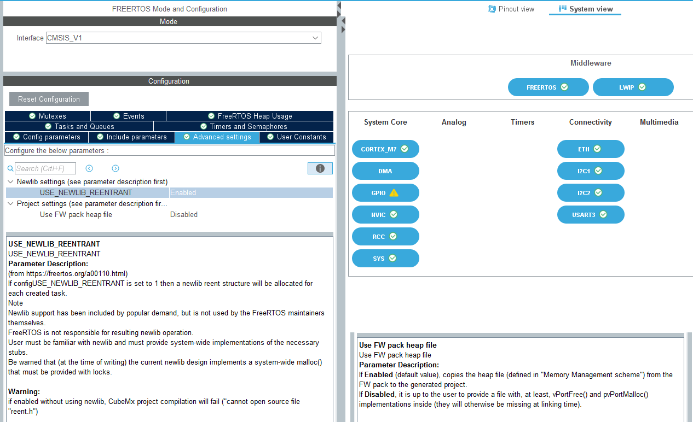

# Modifications for Thread Safety

Some modifications are necessary to resolve BusFault and MemManageFault issues caused by broken code shipped with STM32CubeMX. For details, please see https://nadler.com/embedded/newlibAndFreeRTOS.html .

Problem description :

	Note as of spring 2020: ST has attempted to solve some of problems discussed below, 
	but rather than just redistributing heap_useNewlib (as NXP and others have done), 
	ST has tried to redo the implementation - and failed to do it correctly! Best you 
	delete their unfortunate failed attempts and use proven working code provided here. "
	
Proposed solution:

	Using newlib safely with FreeRTOS - Recommended Solution Details

	If your application needs a complete malloc family implementation, or you are using 
	any newlib functions that require malloc (for example printf family or strtok), do 
	the following (I've provided an implementation below):

    * Implement the hooks required by newlib (sbrk, __malloc_lock/unlock).
    
    * Make sure your linker file matches the sbrk implementation!
    
    * Provide a heap implementation that implements the FreeRTOS memory API 
      using the malloc family of newlib.

	To use the implementation I've provided in your project:

    * Exclude from all builds any current FreeRTOS heap implementation, 
      typically something like: Middlewares\Third_Party\FreeRTOS\Source\portable\MemMang\heap_4.c
      
    * Exclude from all builds any current sbrk implementation. 
      In older versions of CubeMX, ST generated a stand-alone sbrk.c module. Later versions 
      hide it in syscalls.c to obfuscate their messes. Get rid of it!
      
    * Add the module heap_useNewlib_ST.c I've provided.
    
    * If in multiple tasks your application needs a complete snprintf implementation, strtok, 
      dtoa, or other newlib functions requiring reentrancy support, or you're not really sure...
      Configure FreeRTOS for newlib support. 
      In FreeRTOSconfig.h, add the line:
      #define configUSE_NEWLIB_REENTRANT 1
      In CubeMX FreeRTOS options, select configUSE_NEWLIB_REENTRANT + deselect "FW pack heap file".
      
    * If are sure you're only going to access newlib's reentrant routines from a single 
      FreeRTOS task and want to skip configUSE_NEWLIB_REENTRANT (with its attendent overhead)? 
      Ensure malloc is never called except during startup and from the designated single task. 
      Verify with a check in malloc_lock (sorry, I did not provide example code).

## Configuration and Code Modifications

Taking a step back - for thread-safety, each task needs to have a dedicated newlib reentrancy structure. Without that, calls from tasks other than the default task (printf of floats, strToDouble conversion, ...) will fault when attempting to access regions prohibited through an appropriately configured MPU background region.

[nadler.com](https://nadler.com/embedded/newlibAndFreeRTOS.html) - each task needs a dedicated reentrancy structure :

	"For each task, allocate and initialize a newlib reentrancy structure in 
	the task control block (TCB). This adds 96* bytes overhead per task 
	(* size hugely dependant on newlib build options), plus anything else 
	newlib allocates as needed. [...])"

[FreeRTOS Memory Management](https://www.freertos.org/a00111.html) - the memory allocation API is initially provided by FreeRTOS :

	" One embedded / real time system can have very different RAM and timing 
	requirements to another - so a single RAM allocation algorithm will only 
	ever be appropriate for a subset of applications.

"Memory Management scheme" selects which *heap_x.c* file will be copied when the project is generated. *heap_4.c* is the default include, where *pvPortMalloc()* and *vPortFree()* are implemented. Continuing with the above,

	To get around this problem, FreeRTOS keeps the memory allocation API in 
	its portable layer. The portable layer is outside of the source files 
	that implement the core RTOS functionality, allowing an application 
	specific implementation appropriate for the real time system being 
	developed to be provided. When the RTOS kernel requires RAM, instead of 
	calling malloc(), it instead calls pvPortMalloc(). When RAM is being 
	freed, instead of calling free(), the RTOS kernel calls vPortFree(). "

### Configure FreeRTOS for newlib support

In STM32CubeMX, change the following FreeRTOS > Advanced Settings :

* set *configUSE_NEWLIB_REENTRANT 1* (do generate reentrancy structures) 
* set "Use FW pack heap file" to "Disabled" (do not copy the stock heap_4.c file)

### Replace \_sbrk

in *syscalls.c*, add \_\_attribute\_\_((weak)) to override the existing implementation:

	__attribute__((weak)) caddr_t _sbrk(int incr)

### Add heap\_useNewlib_ST.c and modify

[Get heap_useNewlib_ST.c](https://github.com/DRNadler/FreeRTOS_helpers/blob/master/heap_useNewlib_ST.c) and add it to Src/.

As per [leech001 fork](https://github.com/DRNadler/FreeRTOS_helpers/issues/3), insert into heap\_useNewlib_ST.c the following:

	// These configuration symbols could be provided by from build...
	#define configISR_STACK_SIZE_WORDS (0x100)

Finally, "Update CMake Project with STM32CubeMX" and build the project. No errors should be reported, and RAM usage may have changed when compared to before.