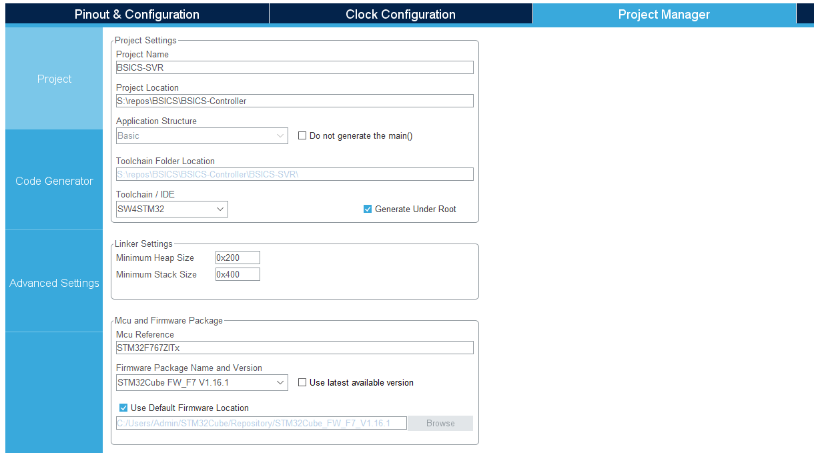
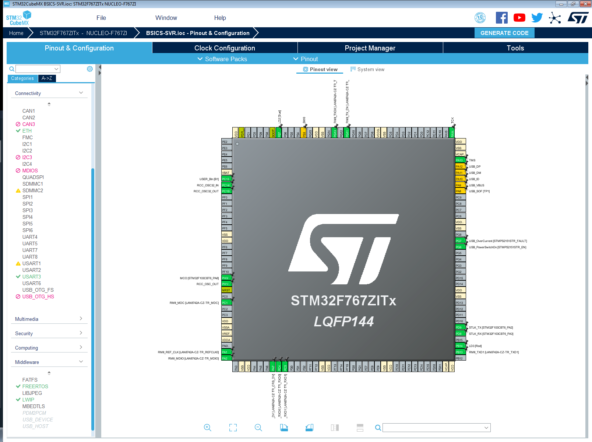
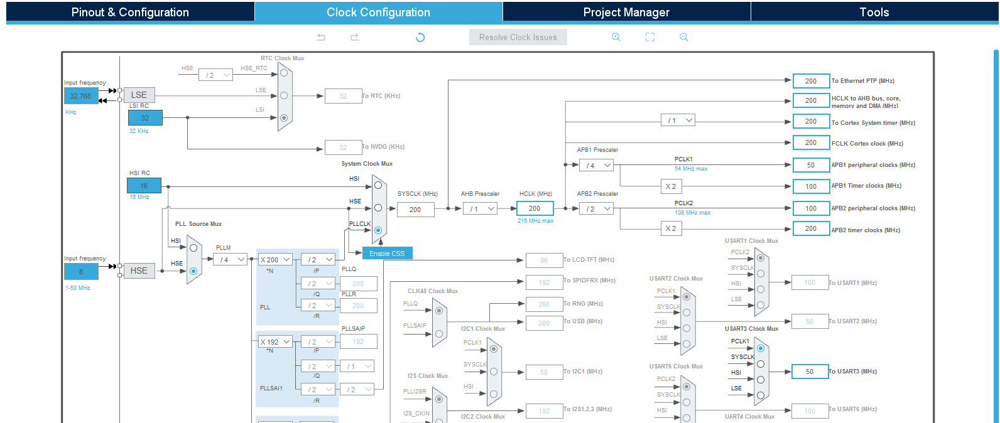

## BSICS-SVR: Creating This Project

The log below described how the basic project was created using CLion and STM32CubeMX.

### Creating a New STM32CubeMX Project With CLion

Using New Project > Embedded > STM32CubeMX, a new project corresponding .ioc file are created. In STM32CubeMX, select the Nucleo-F767ZI board and confirm use of its default peripheral initialization.

Make sure Toolchain/IDE is set to "SW4STM32". 

You can return to STM32CubeMX at any point in time and modify the configuration. CLion will reload files and regenerate the CMake project (unless there are problems with the CMakelists.txt file or its CMakelists_template.txt source). 

**Note: CLion expects project files to be newer than the .ioc timestamp. To avoid CLion nagging about "outdated" files, 1) save changes in STM32CubeMX, 2) GENERATE CODE, 3) close STM32CubeMX declining to "save changes". ** 

#### CMakelists_template.txt

CLion 2021.1 does not provide FPU configuration options in the UI, so compile options have to be set in CMakeLists_template.txt to enable hardware FPU support. Without add\_compile\_options and add\_link\_options below, a [compile-time error](https://youtrack.jetbrains.com/issue/CPP-18629) will occur (see FreeRTOS.h configUSE \_TASK\_FPU\_SUPPORT 1)

	
	# Uncomment for hardware floating point.
	#   Define according to Cortex core:
	#   ARM_MATH_CM7, ARM_MATH_CM4, ARM_MATH_CM3, ARM_MATH_CM0PLUS or ARM_MATH_CM0
	add_compile_definitions(ARM_MATH_CM7;ARM_MATH_MATRIX_CHECK;ARM_MATH_ROUNDING)
	#   Define according to Cortex core
	#   -mfpu specifies floating-point hardware (or hardware emulation) availability.
	#   Permissible names are: ‘auto’, ‘vfpv2’, ‘vfpv3’, ‘vfpv3-fp16’, ‘vfpv3-d16’,
	#   ‘vfpv3-d16-fp16’, ‘vfpv3xd’, ‘vfpv3xd-fp16’, ‘neon-vfpv3’, ‘neon-fp16’,
	#   ‘vfpv4’, ‘vfpv4-d16’, ‘fpv4-sp-d16’, ‘neon-vfpv4’,
	#   ‘fpv5-d16’, ‘fpv5-sp-d16’, ‘fp-armv8’, ‘neon-fp-armv8’ and ‘crypto-neon-fp-armv8’.
	#   Note that ‘neon’ is an alias for ‘neon-vfpv3’ and ‘vfp’ is an alias for ‘vfpv2’.

	#   Examples: CM4: fpu=fpv4-sp-d16, CM7: fpu=fpv5-sp-d16
	#   see for more: https://gcc.gnu.org/onlinedocs/gcc/ARM-Options.html
	add_compile_options(-mfloat-abi=hard -mfpu=fpv5-sp-d16)
	add_link_options(-mfloat-abi=hard -mfpu=fpv5-sp-d16)
	
	# Uncomment for software floating point
	#add_compile_options(-mfloat-abi=soft)

To compile and link Applications/SCPI\_Server/ and libscpi, include\_directories, file() and target\_link\_libraries instructions have to be added: 

	include_directories(${includes} Applications/SCPI_Server/Inc)
	include_directories(Applications/SCPI_Server/Inc Middlewares/Third_Party/libscpi/inc) # added
	
	add_definitions(${defines})
	
	file(GLOB_RECURSE SOURCES ${sources})
	file(GLOB_RECURSE SOURCES ${SOURCES} "Applications/*.*") # added
	
	[...]
	
	add_executable($${PROJECT_NAME}.elf $${SOURCES} $${LINKER_SCRIPT})
	target_link_libraries(${PROJECT_NAME}.elf ${CMAKE_SOURCE_DIR}/Middlewares/Third_Party/libscpi/dist/libscpi.a) # added

include\_directories appends paths, while file() sets the SOURCES variable, so ${SROUCES} has to prepend any subsequent assignment.

----
#### GPIO Configuration

The default Nucleo-144 I/O configuration takes care of most of the settings required for ethernet use. 

The project currently does not use the USB peripheral (USB\_OTG\_HS).

USART3 on PD8, PD9 is added for 115200 Baud 8N1 debug output.

Peripherals will be added later as needed.

----
#### Clock Settings

As per UM1974 "6.8.1 OSC clock supply", STM32F767ZI uses the 8.000 MHz clock from the STM32F103 STLink v2 controller via PH0 RCC\_OSC\_IN. While it's possible to supply an external clock to LAN8742A, the board comes with a dedicated 25.000 MHz crystal.

---- 
#### Linker Script

Some changes to *STM32F767ZITx_FLASH.ld* are required in conjunction with subsequent settings in MPU and ETH. The thought process is also outlined in [community.st.com: memory layout and MPU configuration](https://community.st.com/s/question/0D50X0000C4Nk4GSQS/bug-missing-compiler-and-cpu-memory-barriers).

In short, the following changes are made to establish a 32 kB non-cached (NC) memory region *RAM\_NC* exclusive to ethernet RX /TX buffers and their associated DMA descriptors:

* the \_estack pointer is lowered by 32 kB
* a new memory region *RAM_NC* is added to the *MEMORY* specification at the position of the modified stack pointer, with *LENGTH = 32K*
* definitions for a *.bss_nc* data section placed in *>RAM_NC* which introduces \*(.nc\_bss)
  and \*(.nc\_bss\*) section. The section names will re-occur in *ethernetif.c* variables with  *\_\_attribute\_\_((section(".nc\_bss")))* and *\_\_attribute\_\_((section(".nc\_bss\*")))*
* _sbss\_nc and _ebss\_nc symbols are also added as pointers for memory initialization (zero fill) in *startup\_stm32F767xx.s*.

In detail, this means:

STM32F767 (512 kB): initially \_estack = 0x20080000, new \_estack and RAM\_NC start at 0x20078000

STM32F746 (320 kB): initially \_estack = 0x20050000, new \_estack and RAM\_NC start at 0x20048000

	/* Highest address of the user mode stack */
	_estack = 0x20078000;    /* end of RAM ( = 0x20080000 - RAM_NC LENGTH ) */
	
	/* Generate a link error if heap and stack don't fit into RAM */
	_Min_Heap_Size  = 0x200; /* required amount of heap  */
	_Min_Stack_Size = 0x400; /* required amount of stack */
	
	/* Specify the memory areas */
	MEMORY
	{
	RAM (xrw)       : ORIGIN = 0x20000000, LENGTH =  480K /* 512K - 32K */
	RAM_NC (rw)     : ORIGIN = 0x20078000, LENGTH =   32K /* ORIGIN = 0x20000000 + 480 * 1024 */
	FLASH (rx)      : ORIGIN = 0x00200000, LENGTH = 2048K
	}

To define memory sections the linker will use to place the ethernet RX/TX buffers and DMA descriptors, one adds the new segment below .\_user_heap\_stack {...} >RAM:

	  /* Uninitialized data section into "RAM_NC" Ram type memory */
	  . = ALIGN(4);
	  .bss_nc :
	  {
	    /* This is used by the startup in order to initialize the .bss_nc section */
	    _sbss_nc = .;   /* define a global symbol at bss_nc start */
	    __bss_nc_start__ = _sbss_nc;
	    *(.nc_bss)
	    *(.nc_bss*)
	    *(COMMON)
	
	    . = ALIGN(4);
	    _ebss_nc = .;   /* define a global symbol at bss_nc end */
	    __bss_nc_end__ = _ebss_nc;
	  } >RAM_NC

.bss_nc follows the same pattern as .bss, so the existing data section code can be copied and renamed accordingly.

----
#### Startup/startup_stm32f767xx.s

The startup assembly implements stack pointer and memory initialization, followed by calls to *SystemInit* and ultimately *main()*.

While .bss and .nc\_bss are contiguous and one could zero-fill all memory between \_sbss and \_ebss_nc, it's a worthwhile investment to not make this assumption to avoid running into obscure problems later on.

	ldr  r2, =_sbss
	b  LoopFillZerobss
	
	/* Zero fill the bss segment. */  
	FillZerobss:
	  movs  r3, #0
	  str  r3, [r2], #4
	    
	LoopFillZerobss:
	  ldr  r3, = _ebss
	  cmp  r2, r3
	  bcc  FillZerobss
	  
is implemented to zero-fill the new bss regment (now reduced in size and no longer coinsiding with RAM extents). Right below one adds:
	
	/* Zero fill the bss_nc segment. */
	ldr  r2, =_sbss_nc
	b  LoopFillZerobssnc
	
	FillZerobssnc:
	  movs  r3, #0
	  str  r3, [r2], #4
	
	LoopFillZerobssnc:
	  ldr  r3, = _ebss_nc
	  cmp  r2, r3
	  bcc  FillZerobssnc

as the linker guarantees consistency of the \_sbss\_nc and \_ebss\_nc symbols.

**After making these modifications, it's good practice to store a copy of the modified .ld and .s files in an archive. Currently STM32CubeMX does not appear to remove or overwrite these files unless the processor is changed, but this is a good time to archive them.**

---- 
#### Cortex_M7 and MPU

---- 
#### ETH

---- 
#### FreeRTOS

---- 
#### LwIP

----
#### ETH

---- 
#### NVIC