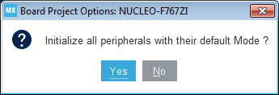
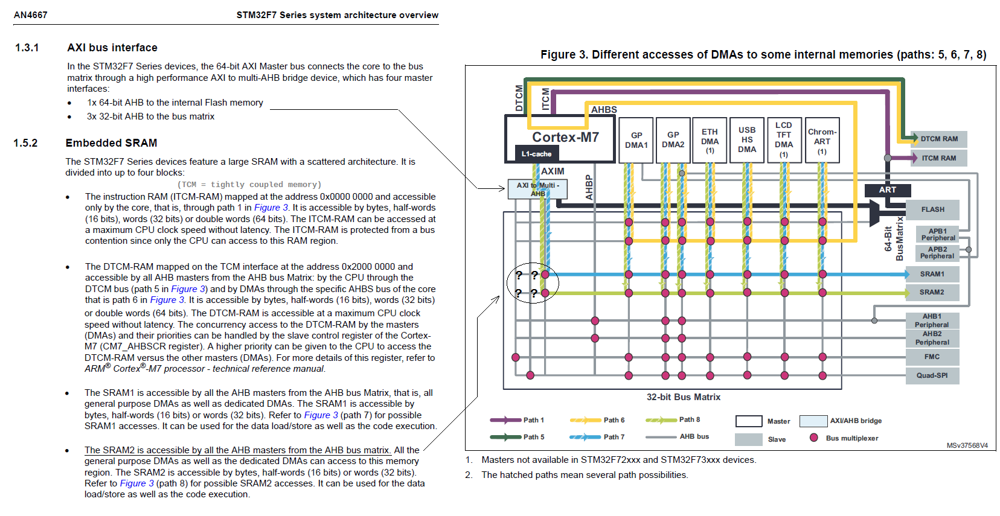

## BSICS-SVR: Creating This Project

The log below described how the basic project was created using CLion and STM32CubeMX. The strategy is to

1. create a new CLion embedded project, use STM32CubeMX to generate code with default initialization for Nucleo-F767ZI in SW4STM32 flavor.
2. Modify CMakeLists_template.txt for hardware floating point support and additional files to be included, compiled and linked.
3. Establish non-cached memory for ETH buffers: modify linker script and startup code to partition RAM, creating a 16 kB non-cached (NC) segment covering SRAM2 for ethernet RX/TX buffers and associated DMA descriptors.
4. Set up STM32F7 core, peripherals and middlewares.
5. Add libscpi and SCPI\_Server.
6. Copy and modify additional code.

Retrospective and logical order: user code quoted for explicitness and discussion will be mentioned again with instructions at a later point in time.

### 1. Creating a New STM32CubeMX Project With CLion

Using New Project > Embedded > STM32CubeMX, a new project corresponding .ioc file are created. In STM32CubeMX, select the Nucleo-F767ZI board and confirm use of its default peripheral initialization.

Make sure Toolchain/IDE is set to "SW4STM32". 

You can return to STM32CubeMX at any point in time and modify the configuration. CLion will reload files and regenerate the CMake project (unless there are problems with the CMakelists.txt file or its CMakeLists_template.txt source). 

**Note: CLion expects project files to be newer than the .ioc timestamp. To avoid CLion nagging about "outdated" files, 1) save changes in STM32CubeMX, 2) GENERATE CODE, 3) close STM32CubeMX declining to "save changes".** 

### 2. Changes To CMakeLists_template.txt

CLion 2021.1 does not provide FPU configuration options in the UI, so compile options have to be set in CMakeLists_template.txt to enable hardware FPU support. Without add\_compile\_options and add\_link\_options below, a [compile-time error](https://youtrack.jetbrains.com/issue/CPP-18629) will occur (see FreeRTOS.h configUSE \_TASK\_FPU\_SUPPORT 1)

	
	# Uncomment for hardware floating point.
	#   Define according to Cortex core:
	#   ARM_MATH_CM7, ARM_MATH_CM4, ARM_MATH_CM3, ARM_MATH_CM0PLUS or ARM_MATH_CM0
	add_compile_definitions(ARM_MATH_CM7;ARM_MATH_MATRIX_CHECK;ARM_MATH_ROUNDING)
	#   Define according to Cortex core
	#   -mfpu specifies floating-point hardware (or hardware emulation) availability.
	#   Permissible names are: ‘auto’, ‘vfpv2’, ‘vfpv3’, ‘vfpv3-fp16’, ‘vfpv3-d16’,
	#   ‘vfpv3-d16-fp16’, ‘vfpv3xd’, ‘vfpv3xd-fp16’, ‘neon-vfpv3’, ‘neon-fp16’,
	#   ‘vfpv4’, ‘vfpv4-d16’, ‘fpv4-sp-d16’, ‘neon-vfpv4’,
	#   ‘fpv5-d16’, ‘fpv5-sp-d16’, ‘fp-armv8’, ‘neon-fp-armv8’ and ‘crypto-neon-fp-armv8’.
	#   Note that ‘neon’ is an alias for ‘neon-vfpv3’ and ‘vfp’ is an alias for ‘vfpv2’.

	#   Examples: CM4: fpu=fpv4-sp-d16, CM7: fpu=fpv5-sp-d16
	#   see for more: https://gcc.gnu.org/onlinedocs/gcc/ARM-Options.html
	add_compile_options(-mfloat-abi=hard -mfpu=fpv5-sp-d16)
	add_link_options(-mfloat-abi=hard -mfpu=fpv5-sp-d16)
	
	# Uncomment for software floating point
	#add_compile_options(-mfloat-abi=soft)

To compile and link Applications/SCPI\_Server/ and libscpi, include\_directories(), file() and target\_link\_libraries() instructions have to be added: 

	include_directories(${includes} Applications/SCPI_Server/Inc)
	include_directories(Applications/SCPI_Server/Inc Middlewares/Third_Party/libscpi/inc) # added
	
	add_definitions(${defines})
	
	file(GLOB_RECURSE SOURCES ${sources})
	file(GLOB_RECURSE SOURCES ${SOURCES} "Applications/*.*") # added
	
	[...]
	
	add_executable($${PROJECT_NAME}.elf $${SOURCES} $${LINKER_SCRIPT})
	target_link_libraries(${PROJECT_NAME}.elf ${CMAKE_SOURCE_DIR}/Middlewares/Third_Party/libscpi/dist/libscpi.a) # added

include\_directories() appends paths, while file() sets the SOURCES variable, so ${SROUCES} has to prepend any subsequent assignment.

CLion automatically detects files, and after finding paths and names occurring in .idea files it is not necessarily clear what to edit. Presumably everything is regenerated from CMake output, making the CMakeLists_template.txt the appropriate place to include and configure dependencies.

----
### 3. Establishing A Non-Cached Memory Region For Ethernet DMA

For ethernet peripheral operation with DMA, it's necessary to
* provide RX + TX buffers and DMA descriptor tables, 
* and to ensure data coherency when DMA controller and Core access the same memory regions.

----
#### Memory Layout and Allocation

Dedicated ICs like Wiznet W5500 (16K), Microchip ENC28J60 (8K), ENC424J600 (24K) and similar have varying amounts of integrated RX / TX buffer memory. Fast STM32 peripherals usually do not have separate full-size buffers. Instead, they mostly rely on direct memory access to internal RAM.

The MAC DMA controller requires packet data buffers, but also tables of ETH\_DMADescTypeDef descriptors. They will be introduced in ethernetif.c and maintained by STM32CubeMX once ETH and LwIP are added.

Extern declarations are added to tag corresponding variable definitions with *\_\_attribute\_\_((section(".nc\_bss")))* and *\_\_attribute\_\_((section(".nc\_bss\*")))* expressions. 
As code maintained by STM32CubeMX will be regenerated when clicking "Generate Code", persistent modifications can only be put in a USER CODE block:

    /* Private variables ---------------------------------------------------------*/

    __ALIGN_BEGIN ETH_DMADescTypeDef  DMARxDscrTab[ETH_RXBUFNB] __ALIGN_END; /* Ethernet Rx MA Descriptor */
    __ALIGN_BEGIN ETH_DMADescTypeDef  DMATxDscrTab[ETH_TXBUFNB] __ALIGN_END; /* Ethernet Tx DMA Descriptor */
    __ALIGN_BEGIN uint8_t Rx_Buff[ETH_RXBUFNB][ETH_RX_BUF_SIZE] __ALIGN_END; /* Ethernet Receive Buffer */
    __ALIGN_BEGIN uint8_t Tx_Buff[ETH_TXBUFNB][ETH_TX_BUF_SIZE] __ALIGN_END; /* Ethernet Transmit Buffer */
     
    /* USER CODE BEGIN 2 */
    
	extern ETH_DMADescTypeDef DMARxDscrTab[ETH_RXBUFNB]  __attribute__((section(".nc_bss")));
	extern ETH_DMADescTypeDef DMATxDscrTab[ETH_TXBUFNB]  __attribute__((section(".nc_bss")));
	extern uint8_t Rx_Buff[ETH_RXBUFNB][ETH_RX_BUF_SIZE] __attribute__((section(".nc_bss*")));
	extern uint8_t Tx_Buff[ETH_TXBUFNB][ETH_TX_BUF_SIZE] __attribute__((section(".nc_bss*")));
	
    /* USER CODE END 2 */

The *nc\_* prefix is an advance mention of the need to set both buffer and DMA descriptor memories as non-cached, see below.

Next, the  internal RAM address ranges for are specified for these *nc\_* sections. The decision is microcontroller-dependent: total RAM size varies, and memories are non-contiguous. To highlight the diversity, here's a comparison between F4 and F7 controllers with Ethernet MAC between which project code might eventually need to be ported: 

* [STM32F4xx](img/STM32F4_memory_organization.jpg) has 112 kB SRAM1 at 0x20000000, contiguous 16 kB SRAM2 at 0x2001C000 and another 64 kB CCM (core-coupled memory) RAM at 0x10000000, 
* [STM32F74xx](img/RM0385_STM32F74xx_memory_map.png) has 16 kB ITCM RAM at 0x00000000, 64 kB DTCM RAM at 0x20000000, contiguous 240 kB SRAM1 at 0x20010000 and contiguous to that 16 kB SRAM2 at 0x2004C000.
* **STM32F76xx** in turn has 16 kB ITCM RAM at 0x00000000, 128 kB DTCM RAM at 0x20000000, contiguous 368 kB at 0x20020000 and contiguous to that **16 kB SRAM2 at 0x2007C0000**.

Instruction and Data Tightly Coupled Memory (ITCM, DTCM) allow time critical execution of ISR code (12 cycles ISR latency). The [STM32F7 System Core presentation](pdf/STM32F7_System_Core_Presentation.pdf) gives a motivational overview. 

For the the purpose of this project though it suffices to note that ITCM is not connected to the AHB bus matrix and not relevant yet, and that DTCM - unlike SRAM1 - is connected to the AHB bus matrix, but accesses are performed through an AHBS slave interface, with the option for CPU priority. 

Of key interest however is the way ETH DMA and the processor core connect to SRAM1 and SRAM2, as shown in the figure below. When comparing to the [STM32F42xxx system architecture](img/STM32F42xxx_system_architecture.png), one notes that Cortex-M7 differs substantially, introducing a 64 bit AHB to internal flash, and turning the dedicated I-Bus, D-Bus and S-Bus (instruction, data, system) processor masters into AHB1, AHB2, AHB3. 

What STM32F4 and STM32F7 system architectures have in common is also the take-away message from Figure 3 below: **ETH DMA <-> SRAM2 and processor core <-> SRAM1 access can happen simultaneously**.  

( source: [AN4667 STM32F7 Series system architecture overview](pdf/AN4667%20-%20STM32F7%20Series%20system%20architecture%20and%20performance.pdf). )

To improve performance, it's thus desirable to utilize concurrent DMA operation and program execution according to Cortex-M7 microcontroller capabilities, in short
* use SRAM1 for data memory,
* use SRAM2 for RX + TX buffers and DMA descriptor tables (SRAM2: 16 kB for all MCUs considered.)

In terms of memory layout it is at this point not clear to the author why examples neglect to move the \_estack pointer from the end of RAM +1 (STM32F74xx: 0x20050000, STM32F76xx: 0x20080000), which is the end of SRAM2, to the end of SRAM1 +1 (STM32F74xx: 0x2004C000, STM32F76xx: 0x2007C000). There may be performance benefits in locating stack memory in SRAM2, but adding ethernet data structures in SRAM2 occupies 2 * 128B + 8 * 1524B = 12448 Bytes, leaving 3936 Bytes for the stack. **In this project, \_estack is moved to the end of SRAM1.** According to a [FreeRTOS Support Archive Question](https://www.freertos.org/FreeRTOS_Support_Forum_Archive/April_2018/freertos_linker_Min_Stack_Size_and_Min_Heap_Size_9d6c9c50j.html), *\_Min\_Stack\_Size = 0x400* in the linker script (.ld) applies to main() and ISRs, but not task stacks, which are allocated by the kernel and come from the heap in SRAM1. 

STM32 ethernet code examples usually also do not elaborate on what changing Memory Protection Unit (MPU) region settings means for stack still residing in SRAM2, possibly due to lack of clarity surrounding MPU nomenclature and use. 

**To summarize**, Ethernet DMA descriptor tables and RX + TX buffers will be allocated in SRAM2 starting at 0x2007C0000 (STM32F767ZI). \_estack will be set to 0x2007C000 (STM32F767ZI).

Please note that some examples will place RAM\_NC in SRAM2, but then specify the memory area LENGTH or MPU region size as 32 kB. STM32F4 and STM32F7 microcontrollers do not have 32 kB size SRAM2 - this only applies to STM32H7. When placing STM32F767 ethernet data structures at 0x20078000, they will reside entirely in SRAM1, which might work with accompanying MPU settings, but without any performance benefits.

**Further reading**

Finally, Cliffe's write-up on [VGA signal generation using GPDMA2 fittingly titled "A Glitch in the Matrix"](http://cliffle.com/blog/glitch-in-the-matrix/) for a Cortex-M4 adventure in ensuring time-accurate data transfers is also insightful.

Also of interest is a series of OpenMV blog posts on the subject which can be revisited after the MPU section to follow.

[openmv.io/blogs/news/the-path-to-performance-part-1](https://openmv.io/blogs/news/the-path-to-performance-part-1)

[openmv.io/blogs/news/the-path-to-performance-part-2](https://openmv.io/blogs/news/the-path-to-performance-part-2)

[openmv.io/blogs/news/the-path-to-performance-part-3](https://openmv.io/blogs/news/the-path-to-performance-part-3)

---
#### Changes To STM32F767ZITx_FLASH.ld

Some changes to the *STM32F767ZITx_FLASH.ld* linker script are required in conjunction with subsequent settings in MPU and ETH DMA. The thought process is also outlined in [community.st.com: missing compiler and cpu memory barriers](https://community.st.com/s/question/0D50X0000C4Nk4GSQS/bug-missing-compiler-and-cpu-memory-barriers).

In short, the following changes are made to establish a 16 kB non-cached (NC) memory region *RAM\_NC* exclusive to ethernet RX /TX buffers and their associated DMA descriptors:

* the \_estack pointer is lowered by 16 kB (from the end of SRAM2 +1 to the end of SRAM1 +1)
* a new memory region *RAM_NC* is added to the *MEMORY* specification at the position of the modified stack pointer, with *LENGTH = 16K*
* definitions for a *.bss_nc* data section placed in *>RAM_NC* which introduces \*(.nc\_bss)
  and \*(.nc\_bss\*) sections. The section names will re-occur in *ethernetif.c* variables with  *\_\_attribute\_\_((section(".nc\_bss")))* and *\_\_attribute\_\_((section(".nc\_bss\*")))*
* _sbss\_nc and _ebss\_nc symbols are also added as pointers for memory initialization (zero fill) in *startup\_stm32F767xx.s*.

In detail, this means:

STM32F767 (512 kB): initially \_estack = 0x20080000, new \_estack and RAM\_NC start at 0x2007C000

STM32F746 (320 kB): initially \_estack = 0x20050000, new \_estack and RAM\_NC start at 0x2004C000

The [Cortex-M7 memory map](img/CM7_memory_model.png) shows the SRAM address range starting at ORIGIN = 0x20000000 as in the linker script. 

	/* Highest address of the user mode stack */
	_estack = 0x2007C000;    /* end of RAM ( = 0x20080000 - RAM_NC LENGTH ) */
	
	/* Generate a link error if heap and stack don't fit into RAM */
	_Min_Heap_Size  = 0x200; /* required amount of heap  */
	_Min_Stack_Size = 0x400; /* required amount of stack */
	
	/* Specify the memory areas */
	MEMORY
	{
	RAM (xrw)       : ORIGIN = 0x20000000, LENGTH =  496K /* 512K - 16K */
	RAM_NC (rw)     : ORIGIN = 0x2007C000, LENGTH =   16K /* ORIGIN = 0x20000000 + 496 * 1024 */
	FLASH (rx)      : ORIGIN = 0x00200000, LENGTH = 2048K
	}

To define memory sections the linker will use to place the ethernet RX/TX buffers and DMA descriptors, a new section .bss_nc will follow the same pattern as .bss, so a copy of the .bss definition can be pasted edited.

One adds the new section below .\_user_heap\_stack {...} >RAM:

	  /* Uninitialized data section into "RAM_NC" Ram type memory */

	  . = ALIGN(4);
	  .bss_nc (NOLOAD) :
	  {
	    /* This is used by the startup in order to initialize the .bss_nc section */
	    _sbss_nc = .;   /* define a global symbol at bss_nc start */
	    __bss_nc_start__ = _sbss_nc;
	    *(.nc_bss)
	    *(.nc_bss*)
	    *(COMMON)
	
	    . = ALIGN(4);
	    _ebss_nc = .;   /* define a global symbol at bss_nc end */
	    __bss_nc_end__ = _ebss_nc;
	  } >RAM_NC

Section attributes *\_\_attribute\_\_((section(".nc\_bss")))* and *\_\_attribute\_\_((section(".nc\_bss\*")))* added to variable declarations instruct the linker to allocate these in the RAM\_NC segment. After compilation, the .map file will show successful allocation, e.g. based on the changes in *ethernetif.c* made later on.

**NOLOAD**

Without *(NOLOAD)*, the linker will treat the new memory section as flash, and the .bin file will cover the entire range from 0x00200000 to 0x20080000. The problems this causes manifest in multiple ways. Not only is the .bin file larger than 520 MB, but in debug sessions, a warning

    Warn : no flash bank found for address 0x2007C000
    ...
    shutdown command invoked

can also be seen. With MPU settings in place, a fault can occur, terminating the debug session. One can use *objcopy --remove-section <..>* to remove sections from .elf files. NOLOAD as per [GNU ld documentation](https://ftp.gnu.org/old-gnu/Manuals/ld-2.9.1/html_node/ld_21.html) means

	The linker will process the section normally, but will mark it so that a program loader will not load it into memory. 

As the terminology isn't an exact match (no bootloader, but code execution from flash) when it comes to [NOLOAD sections in embedded software](https://stackoverflow.com/questions/57181652/understanding-linker-script-noload-sections-in-embedded-software), the meaning here is: no attempt will be made to download a RAM section marked NOLOAD into flash memory.

**Order of declaration**

Variables are generally allocated in their order of appearance in the code, so explicitly ordering them by using both *\*(.nc\_bss)* and  *\*(.nc\_bss\*)* is not strictly necessary. However, overlapping memory protection unit (MPU) regions will require the DMA descriptors to be exactly at the beginning of *RAM\_NC* (they're 2x 128 Bytes and the MPU region covers 256 Bytes). Using two sub-sections instead of *\*(.nc\_bss)* alone, and exclusively using *\*(.nc\_bss)* for the DMA descriptors guarantees proper allocation independent of the order of variable declarations and definitions. One practical benefit would be the ability to re-organize SRAM2 when *ETH\_RXBUFNB* and *ETH\_TXBUFNB* were to be changed, e.g. prompting the need to expand to a 512 Byte region for DMA descriptor tables.

**Checking the .map file**

To verify the success of the section organization above, linker decisions can be inspected in the cmake-build-xxx/BSIS-SVR.map files:

	.bss_nc         0x2007c000     0x30a0
	                0x2007c000                _sbss_nc = .
	                0x2007c000                __bss_nc_start__ = _sbss_nc
	 *(.nc_bss)
	 .nc_bss        0x2007c000      0x100 CMakeFiles/BSICS-SVR.elf.dir/Src/ethernetif.c.obj
	                0x2007c000                DMARxDscrTab
	                0x2007c080                DMATxDscrTab
	 *(.nc_bss*)
	 .nc_bss*       0x2007c100     0x2fa0 CMakeFiles/BSICS-SVR.elf.dir/Src/ethernetif.c.obj
	                0x2007c100                Rx_Buff
	                0x2007d8d0                Tx_Buff
	 *(COMMON)
	                0x2007f0a0                . = ALIGN (0x4)
	                0x2007f0a0                _ebss_nc = .
	                0x2007f0a0                __bss_nc_end__ = _ebss_nc

512 kB and 320 kB SRAM sizes are multiples of 16 kB, so RAM\_NC ORIGIN will be 16 kB - aligned as well, which is required for MPU configuration later on.

----
#### Startup/startup_stm32f767xx.s

The startup assembly implements stack pointer and memory initialization, followed by calls to *SystemInit* and ultimately *main()*.

While .bss and .nc\_bss are contiguous and one could zero-fill all memory between \_sbss and \_ebss_nc, it's a worthwhile investment to not make this assumption to avoid running into obscure problems later on.

	ldr  r2, =_sbss
	b  LoopFillZerobss
	
	/* Zero fill the bss segment. */  
	FillZerobss:
	  movs  r3, #0
	  str  r3, [r2], #4
	    
	LoopFillZerobss:
	  ldr  r3, = _ebss
	  cmp  r2, r3
	  bcc  FillZerobss
	  

is already implemented to zero-fill the (now-modified) bss memory segment (now reduced in size and no longer coinciding with RAM extents). Right below one adds:
	
	/* Zero fill the bss_nc segment. */
	ldr  r2, =_sbss_nc
	b  LoopFillZerobssnc
	
	FillZerobssnc:
	  movs  r3, #0
	  str  r3, [r2], #4
	
	LoopFillZerobssnc:
	  ldr  r3, = _ebss_nc
	  cmp  r2, r3
	  bcc  FillZerobssnc

as the linker guarantees consistency of the \_sbss\_nc and \_ebss\_nc symbols.

**After making these modifications, it's good practice to store a copy of the modified .ld and .s files in an archive. Currently STM32CubeMX does not appear to remove or overwrite these files unless the processor is changed, but this is a good time to archive them.**

----
#### MPU configuration: Ensuring Data Coherency

Please see the [**detailed description of the Cortex-M7 MPU**](readme_mpu.md) for an attempt to elucidate the MPU attributes and terminology. The focus on the sub-section below will be on the practical use for this project.

##### MPU configuration

Three regions are defined. When regions overlap, the region with the highest number defines the attributes at the evaluated address.

* Region 0: Safe Background region
	- Strongly Ordered type memory
	- no read and write access, in both Handler and Thread mode
	- prevents speculative access and speculative execution of external RAM address range
* Region 1: 
	- Normal type memory in SRAM2 (all 16 kB of SRAM2)
	- no code execution, not cacheable; Shareable has no effect on Cortex-M7 due to lack of cache coherency logic - STM32F7/H7 NOT_SHAREABLE means D-Cache is disabled. Can also be set to MPU\_ACCESS\_NOT\_SHAREABLE
* Region 2:
	- Device type memory in SRAM2, same Base Address as Region 1 (nested, 256 Bytes at the beginning, 0x2007C000). 
	- no code execution, not cacheable, not shareable

MPU\_Config() is generated from the [corresponding STM32CubeMX Cortex-M7 Mode and Configuration](img/MPU_eth_regions_with_safe_background.png).

	  /* Disables the MPU */
	  HAL_MPU_Disable();
	  /** Initializes and configures the Region and the memory to be protected
	  */
	  MPU_InitStruct.Enable = MPU_REGION_ENABLE;
	  MPU_InitStruct.Number = MPU_REGION_NUMBER0;
	  MPU_InitStruct.BaseAddress = 0x0;
	  MPU_InitStruct.Size = MPU_REGION_SIZE_4GB;
	  MPU_InitStruct.SubRegionDisable = 0x87;
	  MPU_InitStruct.TypeExtField = MPU_TEX_LEVEL0;
	  MPU_InitStruct.AccessPermission = MPU_REGION_NO_ACCESS;
	  MPU_InitStruct.DisableExec = MPU_INSTRUCTION_ACCESS_DISABLE;
	  MPU_InitStruct.IsShareable = MPU_ACCESS_SHAREABLE;
	  MPU_InitStruct.IsCacheable = MPU_ACCESS_NOT_CACHEABLE;
	  MPU_InitStruct.IsBufferable = MPU_ACCESS_NOT_BUFFERABLE;
	  HAL_MPU_ConfigRegion(&MPU_InitStruct);
	  
	  /** Initializes and configures the Region and the memory to be protected
	  */
	  MPU_InitStruct.Enable = MPU_REGION_ENABLE;
	  MPU_InitStruct.Number = MPU_REGION_NUMBER1;
	  MPU_InitStruct.BaseAddress = (uint32_t) &_sbss_nc;
	  MPU_InitStruct.Size = MPU_REGION_SIZE_16KB;
	  MPU_InitStruct.SubRegionDisable = 0x0;
	  MPU_InitStruct.TypeExtField = MPU_TEX_LEVEL1;
	  MPU_InitStruct.AccessPermission = MPU_REGION_FULL_ACCESS;
	  MPU_InitStruct.DisableExec = MPU_INSTRUCTION_ACCESS_DISABLE;
	  MPU_InitStruct.IsShareable = MPU_ACCESS_SHAREABLE;
	  MPU_InitStruct.IsCacheable = MPU_ACCESS_NOT_CACHEABLE;
	  MPU_InitStruct.IsBufferable = MPU_ACCESS_NOT_BUFFERABLE;
	  HAL_MPU_ConfigRegion(&MPU_InitStruct);
	  
	  /** Initializes and configures the Region and the memory to be protected
	  */
	  MPU_InitStruct.Enable = MPU_REGION_ENABLE;
	  MPU_InitStruct.Number = MPU_REGION_NUMBER2;
	  MPU_InitStruct.BaseAddress = (uint32_t) &_sbss_nc;
	  MPU_InitStruct.Size = MPU_REGION_SIZE_256B;
	  MPU_InitStruct.SubRegionDisable = 0x0;
	  MPU_InitStruct.TypeExtField = MPU_TEX_LEVEL0;
	  MPU_InitStruct.AccessPermission = MPU_REGION_FULL_ACCESS;
	  MPU_InitStruct.DisableExec = MPU_INSTRUCTION_ACCESS_DISABLE;
	  MPU_InitStruct.IsShareable = MPU_ACCESS_SHAREABLE;
	  MPU_InitStruct.IsCacheable = MPU_ACCESS_NOT_CACHEABLE;
	  MPU_InitStruct.IsBufferable = MPU_ACCESS_BUFFERABLE;
	  HAL_MPU_ConfigRegion(&MPU_InitStruct);
	  
	  /* Enables the MPU */
	  HAL_MPU_Enable(MPU_PRIVILEGED_DEFAULT);

The author does not know of a way to consistently induce speculative access faults, but reads to external RAM range or attempts for code execution to trigger a HardFault (or MemManage fault if enabled, default: not enabled).

Stack pointer: were \_estack to remain at the end of SRAM2, it would be in a non-cached SRAM2 region accessed over the bus matrix, and competing with DMA and processor access. Here, \_estack is moved to the end of SRAM1, which has its own access path trough the bus matrix and can be in L1 cache. A better option would be to enable and move \_estack to zero-waitstate DTCM.

**Enabling interrupts**

in *stm32f7xxit.c*, there are

	void HardFault_Handler(void); // This function handles Hard fault interrupt.
	void MemManage_Handler(void); // This function handles Memory management fault.
	void BusFault_Handler(void); // This function handles Pre-fetch fault, memory access fault.
	void UsageFault_Handler(void); // This function handles Undefined instruction or illegal state.

which need to be enabled in the STM32CubeMX project under NVIC, and have user code sections for printf() output generation or other reporting.

In *main.c*, SCB->SHCSR interrupt bits are set:

	/* USER CODE BEGIN 1 */
	
	/ * Set all three (USGFAULTENA, BUSFAULTENA, and MEMFAULTENA) fault enable bits
	* in the System Control Block, System Handler Control and State Register.
	* Otherwise these faults are handled as hard faults by HardFault_Handler().
	*/
	SCB->SHCSR |= SCB_SHCSR_MEMFAULTENA_Msk // will also be set by HAL_MPU_Enable() below
	              | SCB_SHCSR_BUSFAULTENA_Msk
	              | SCB_SHCSR_USGFAULTENA_Msk;
	
	/* USER CODE END 1 */
	
	/* MPU Configuration--------------------------------------------------------*/
	MPU_Config();

**Further reading**

[DMA is not working on STM32H7 devices, handling DMA buffers with D-Cache enabled](https://community.st.com/s/article/FAQ-DMA-is-not-working-on-STM32H7-devices)

----
### 4. Set Up Core, Peripherals And Middlewares

#### GPIO Configuration

The default Nucleo-144 I/O configuration takes care of most of the settings required for ethernet use. 

The project currently does not use the USB peripheral (USB\_OTG\_HS).

USART3 on PD8, PD9 is added for 115200 Baud 8N1 debug output.

Peripherals will be added later as needed.

----
#### Clock Settings

As per UM1974 "6.8.1 OSC clock supply", STM32F767ZI uses the 8.000 MHz clock from the STM32F103 STLink v2 controller via PH0 RCC\_OSC\_IN. While it's possible to supply an external clock to LAN8742A, the board comes with a dedicated 25.000 MHz crystal.

---- 
#### Cortex-M7

---- 
#### ETH

---- 
#### FreeRTOS

---- 
#### LwIP

----
#### ETH

---- 
#### NVIC

---- 
#### USART3
